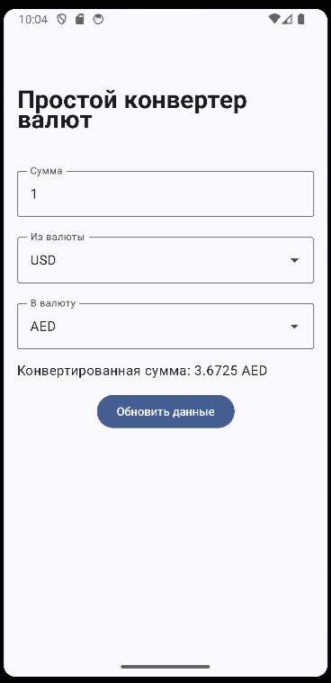
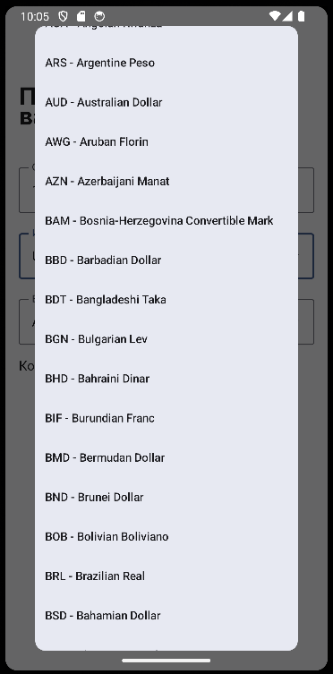

# Simple Converter

Простое приложение для конвертации валют.

## Содержание

- [Описание](#описание)
- [Стэк](#стэк)
- [Использование](#использование)
- [Функции](#функции)
- [Скрины](#скрины)

## Описание

Simple Converter - Простое мобильное приложение с аскетичным дизайном и актуальными обменными курсами, и гарантией максимальной точности конвертаций. Приложение использует API от ExchangeRate-API для получения и обновления обменных курсов в реальном времени.

## Стэк

- Kotlin
- Retrofit
- Coroutines
- Flow
- MVVM
- Clean Architecture

## Функции

1. Ввод суммы: Пользователь вводит сумму для конвертации.

2. Выбор валют: Пользователь выбирает исходную и целевую валюты из списков.

3. Конвертация: Приложение конвертирует сумму, используя актуальные курсы.

4. Отображение результата: Результат конвертации отображается на экране.

## Скрины

